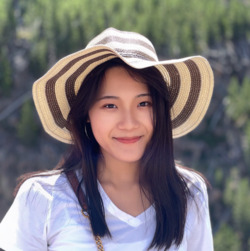
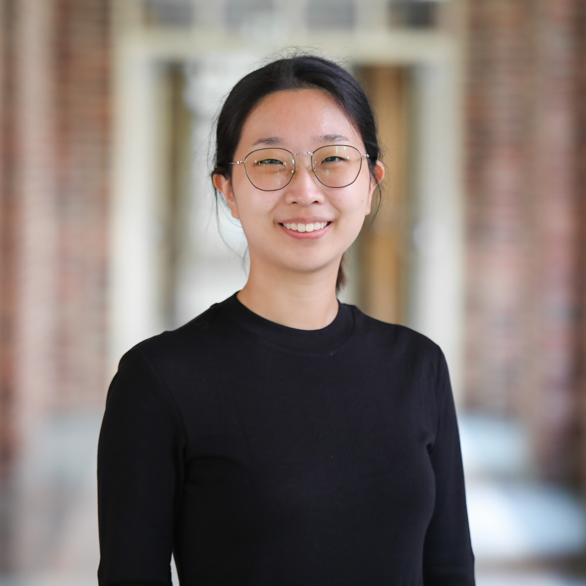
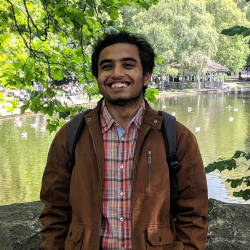

<!-- Convert images to right size using imagemajik-->
<!-- from here:  https://askubuntu.com/questions/135477/how-can-i-scale-all-images-in-a-folder-to-the-same-width-->
<!-- convert 'michelle.jpg[250x]' michelle-resized.jpg -->

     <a href="http://justin-silverman.com"> Dr. Justin Silverman, MD, PhD</a>
 Principle Investigator

     
<a href="https://ist.psu.edu/directory/tuc579">Tinghua Chen</a>
  PhD Student, Informatics

     
<a href="https://science.psu.edu/stat/people/wpg5129">Won Gu</a>
  PhD Student, Statistics

     <a href="https://maxwellkonnaris.com/"> Maxwell Konnaris</a>
  PhD Student, Bioinformatics and Genomics

   <a href="https://www.linkedin.com/in/manansaxena05/">Manan Saxena</a>  
Masters (Graduated)   and PhD Student (Current), Informatics

   <a href="https://ist.psu.edu/directory/zjs5273">Ziang Shi</a>  
PhD Student, Informatics

     <a href="https://pubmed.ncbi.nlm.nih.gov/?term=Andrew+Sugarman"> Andrew Sugarman</a>
  PhD Student, Bioinformatics and Genomics

# Graduated

     <a href="https://www.huck.psu.edu/people/kyle-mcgovern"> Dr. Kyle McGovern, PhD </a>
  PhD in Bioinformatics and Genomics

     <a href="https://ist.psu.edu/directory/map5672"> Dr. Michelle Nixon, PhD</a>
  Assistant Research Professor

   <a href="https://ist.psu.edu/directory/zxm5153">Zhao Ma</a>  
Masters of Science in Informatics

<a href="https://ist.psu.edu/directory/fbm5122">Farhani Momotaz</a>  
Masters of Science in Informatics

