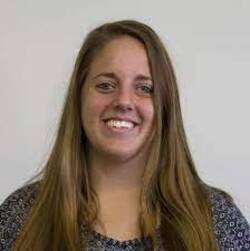

<!-- Convert images to right size using imagemajik-->
<!-- from here:  https://askubuntu.com/questions/135477/how-can-i-scale-all-images-in-a-folder-to-the-same-width-->
<!-- convert 'michelle.jpg[250x]' michelle-resized.jpg -->

      [Justin Silverman (PI)](http://justin-silverman.com)

    [Michelle Nixon (Assistant Research Professor)](https://ist.psu.edu/directory/map5672)

   
[Kyle McGovern (PhD Student, Bioinformatics and Genomics)](https://www.huck.psu.edu/people/kyle-mcgovern)

Andrew Sugarman (PhD Student, Bioinformatics and Genomics))

Tinghua Chen (PhD Student, Informatics)

Zhao Ma (Masters Student, Informatics)

# Graduated

[Farhani Momotaz (Masters Student, Informatics)](https://ist.psu.edu/directory/fbm5122)

