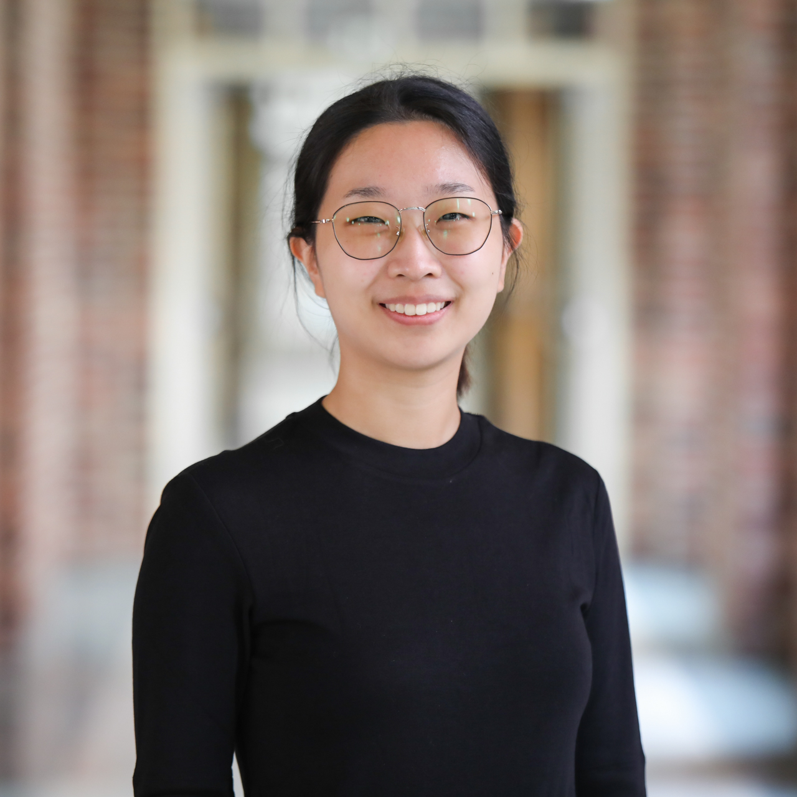

<!-- Convert images to right size using imagemajik-->
<!-- from here:  https://askubuntu.com/questions/135477/how-can-i-scale-all-images-in-a-folder-to-the-same-width-->
<!-- convert 'michelle.jpg[250x]' michelle-resized.jpg -->

  
  
<a href="http://justin-silverman.com"> Dr. Justin Silverman, MD, PhD</a>
 Principal Investigator
  

  
  

    <a href="https://www.linkedin.com/in/vandana-agarwala-26a206169/">Vandana Agarwala</a> 
    PhD Student, Statistics  
    <i>Uncertainty Quantification for ML/AI, High-Throughput Drug Screening Assays</i>
  

  
  

    <a href="https://www.linkedin.com/in/allen-baumgardner-zuzik-7a481768/">Allen Baumgardner-Zuzik</a> 
    PhD Student, Informatics  
    <i>Scalable Bayesian Inference</i>
  

  
  

    <a href="https://ist.psu.edu/directory/tuc579">Tinghua Chen</a> 
    PhD Student, Informatics 
    <i>Scalable Bayesian Semiparametrics, Causal Inference</i>
  

  
  

    <a href="https://science.psu.edu/stat/people/wpg5129">Won Gu</a> 
    PhD Student, Statistics 
    <i>Sparse Bayesian Partially Identified Models, Theory of Identifiability, Measure Theory</i>
  

  
  

    <a href="https://maxwellkonnaris.com/">Maxwell Konnaris</a> 
    PhD Student, Bioinformatics and Genomics 
    <i>Scale Reliant Covariance Estimation, Machine Learning Methods for Quantitative Sequence Analysis</i>
  

  
  

    <a href="https://www.linkedin.com/in/dharmikrathod/">Dharmik Rathod</a> 
    Masters Student, Informatics 
    <i>Bayesian Hierarchical Linear Models, PCR Bias</i>
  

  
  

    <a href="https://www.linkedin.com/in/manansaxena05/">Manan Saxena</a> 
    Masters (Graduated) and PhD Student (Current), Informatics 
    <i>Scalable Bayesian Hierarchical Time-Series Models, Theory of Identifiability for ML/AI, Statistical Learning Theory, Functional Data Analysis</i>
  

  
  

    <a href="https://ist.psu.edu/directory/zjs5273">Ziang Shi</a> 
    PhD Student, Informatics 
    <i>Uncertainty Quantification for ML/AI, Transcription Factor Binding Prediction</i>
  

# Graduated

  
  

    <a href="https://pubmed.ncbi.nlm.nih.gov/?term=Andrew+Sugarman">Dr. Andrew Sugarman, PhD</a> 
    MD and PhD Student, Bioinformatics and Genomics 
    <i>Applications of Topological and Functional Data Analysis to Image Analysis in Oncology</i>
  

  
  

    <a href="https://www.huck.psu.edu/people/kyle-mcgovern">Dr. Kyle McGovern, PhD</a> 
    PhD in Bioinformatics and Genomics 
    <i>Scale Reliant Inference, Bayesian-Frequentist Hybrid Methods, Microbiome and Gene Expression Studies</i>
  

  
  

    <a href="https://ist.psu.edu/directory/map5672">Dr. Michelle Nixon, PhD</a> 
    Assistant Research Professor 
    <i>Scale Reliant Inference, Genomics, Clinical Informatics</i>
  

  
  

    <a href="https://www.zhaoma98.com/">Zhao Ma</a> 
    Masters of Science in Informatics 
    <i>Scale Reliant Inference, High-Dimensional Covariance Estimation</i>
  

  
  

    <a href="https://www.linkedin.com/in/farhani-momo/">Farhani Momotaz</a> 
    Masters of Science in Informatics 
    <i>Bayesian Decision Theory in Clinical Medicine</i>
  

